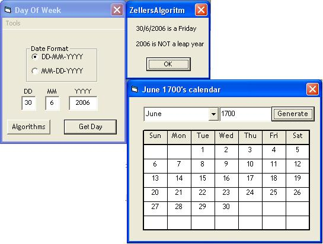



## Zellers Algorithm and dynamic calendar

### Description

This submission is based around Zellers Algorithm (whcih calculates what day of the week a date falls on) There are some other "zellers algorithms" on the internet that do not work, this one is from the MEI Decision Mathematics 1 book (about page 1 I think). From this code I have created a calendar that can show a months worth of days from the year 0 to the year 9999 (though they're Gregorian dates not Julian for dates, though that could be an option for the future!) Oh and it can calculate leap years as well
 
### More Info
 
Just the date you wish to check

Has all the algorithms written in plain english that can be accessed when the app is running

The day of the week that that day occured

None known

             |
---                |---
**Submitted On**   |2006-06-17 12:50:34
**By**             |[Ashley Butler](https://github.com/Planet-Source-Code/PSCIndex/blob/master/ByAuthor/ashley-butler.md)
**Level**          |Intermediate
**User Rating**    |5.0 (20 globes from 4 users)
**Compatibility**  |VB 5\.0, VB 6\.0
**Category**       |[Math/ Dates](https://github.com/Planet-Source-Code/PSCIndex/blob/master/ByCategory/math-dates__1-37.md)
**World**          |[Visual Basic](https://github.com/Planet-Source-Code/PSCIndex/blob/master/ByWorld/visual-basic.md)
**Archive File**   |[Zellers\_Al2003576302006\.zip](https://github.com/Planet-Source-Code/ashley-butler-zellers-algorithm-and-dynamic-calendar__1-65819/archive/master.zip)

